# 🌿 MindMate

**MindMate** is a mental health support platform created to provide affordable, accessible, and safe online help for students, adults, and anyone who may not have access to expensive therapy.  
The project begins with simple but impactful features, while leaving space for future growth into a more comprehensive support platform.  

---

## 🎯 Goals
- ✅ Provide **affordable and accessible mental health support** to students, adults, and people unable to pay for a specialist.  
- ✅ Create a **safe online space** where users feel comfortable and free to share their thoughts.  
- ✅ Help users, especially **students struggling with mobile addiction**, by offering quick support through the app.  
- ✅ Build a platform that starts small but grows — eventually offering **affordable therapy sessions** and advanced features.  

---

## 🗂 Objectives
- 🏗️ Build the **core features**: home page, sign-up page, and chat feature for immediate support.  
- 📱 Ensure **mobile-first design**, since many users will access MindMate on phones.  
- 🔒 Securely **save chat history and user data**, so users never lose progress.  
- 📅 Establish a **roadmap for growth**, including booking with affordable therapists and a **video call option** in future.  

---

## 🖥️ Outputs
- 🌐 **Landing Page** — professional homepage with privacy & terms.  
- 🔑 **Sign-Up & Login Pages** — user onboarding and authentication entry points.  
- 💬 **Chat Feature** — interactive chatbot for immediate support.  
- 👩‍⚕️ **Expert Profiles** — cards with expert info + mock booking system.  
- 🎥 **Calls Page** — placeholder for video/audio therapy sessions.  
- ⚖️ **Legal Disclaimers** — ensuring clarity that this is not medical diagnosis.  

---

## 🛠️ Tech Stack
- **Frontend:** HTML, CSS, JavaScript  
- **Backend (planned):** Firebase (Authentication, Database, Hosting)  
- **Past Work:** Django (initial backend exploration)  
- **Hosting Options:** GitHub Pages / Firebase Hosting

---

## 🚀 Demo

### 🎥 Screen Recording  


### 📸 Screenshots
**Homepage**  
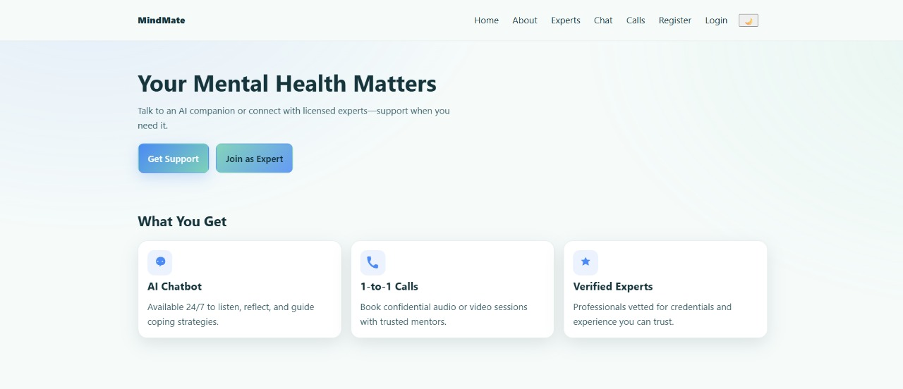
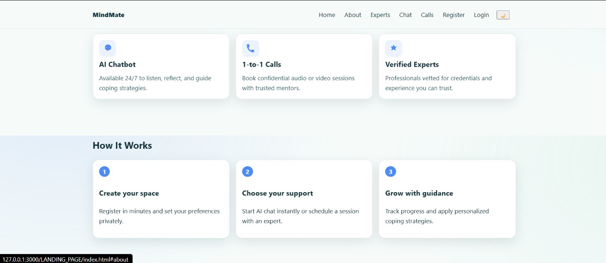

**Registration Page**
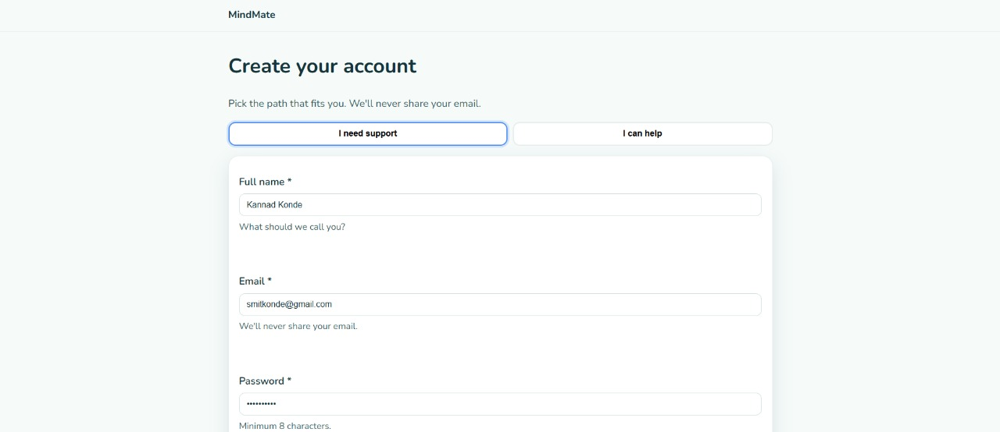
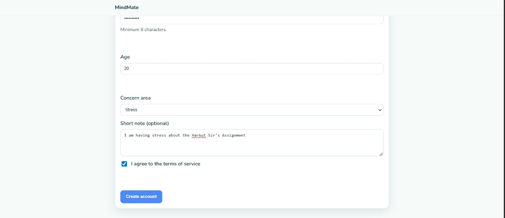
.jpg)
.jpg)
.jpg)

**Login Page**
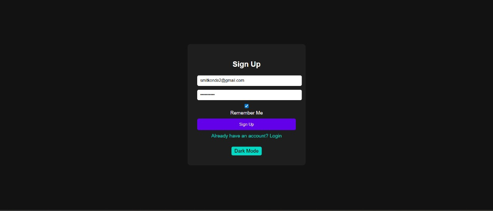
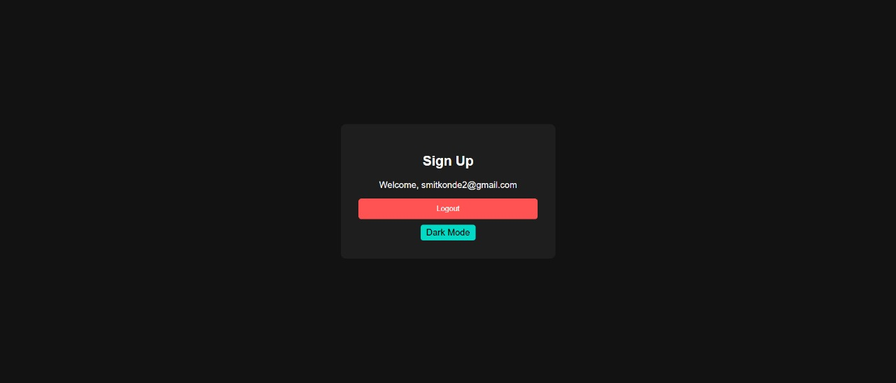


**Experts Page**  

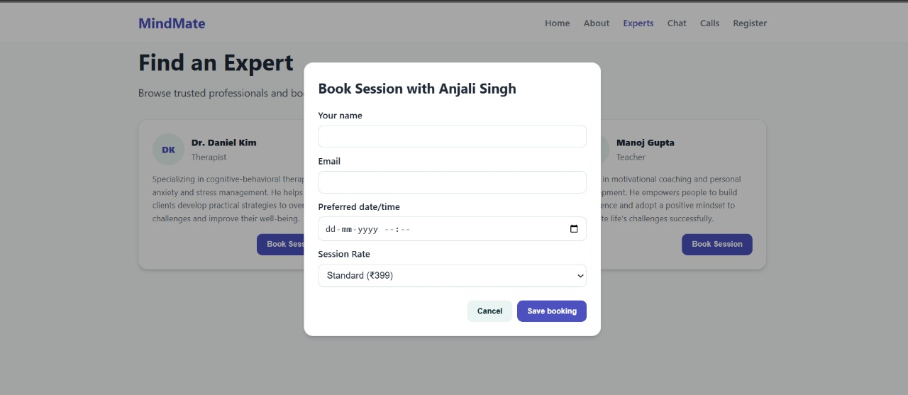
.jpg)

**Chat Feature**  
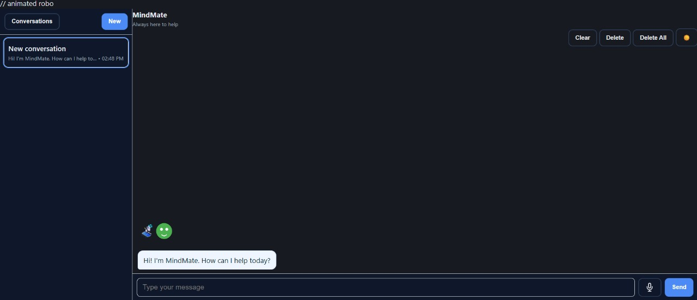
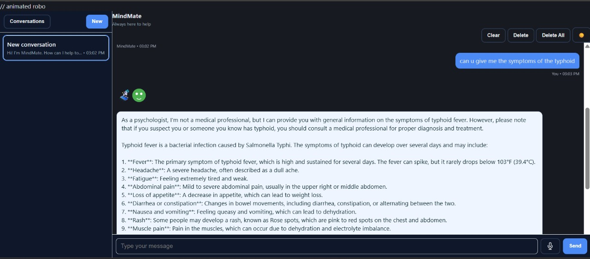

**Calls-Booking Page**

.jpg)

**Privacy-Policy Page**
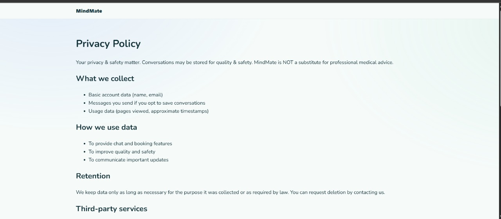
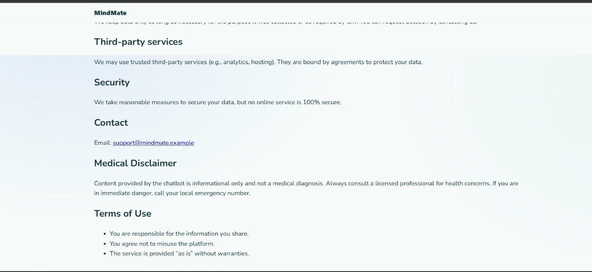

**Dark-Mode**
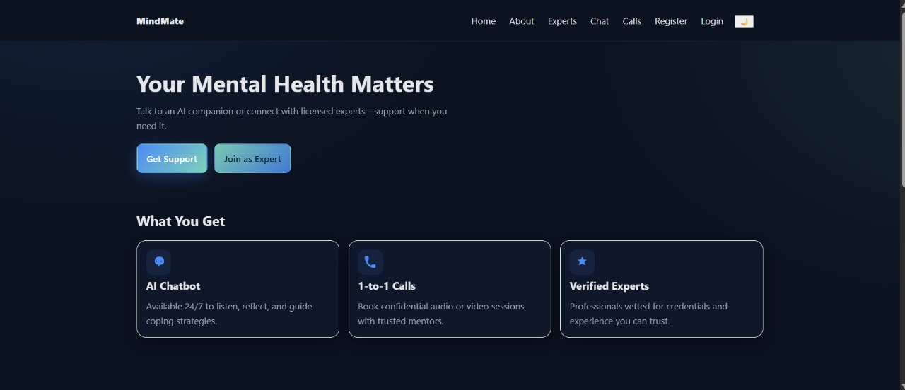
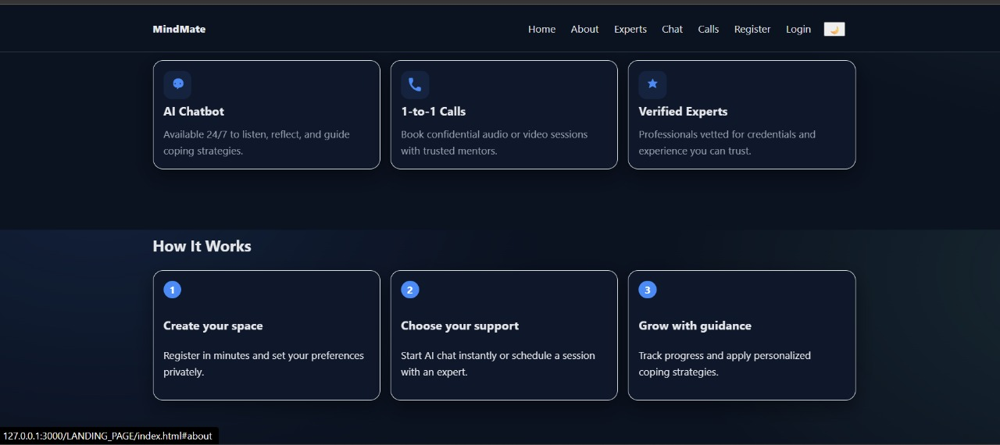

---

## 🛠️ Tech Stack
- **Frontend:** HTML, CSS, JavaScript  
- **Backend (planned):** Firebase (authentication, database, hosting)  
- **Past Work:** Initial backend exploration with Django  
- **Hosting Options:** GitHub Pages / Firebase Hosting  

---

## 📦 Setup & Usage
📌 To open the website locally:
1. Clone this repository:  
   ```bash
   git clone https://github.com/<your-username>/MindMate.git
2.Open LANDING_PAGE/index.html in your browser.
3.Navigate to other features using the menu links.

---

## 🌐 Live Demo
🔗 Try MindMate Here- This project is currently in the MVP/Prototype phase and is intended to be run locally directly from the file system.
