<div align="center">


# MindMate 🌿

### *Accessible Mental Health Support, Reimagined for the Digital Generation*

> *A student-built platform engineering empathy at scale — because quality mental health support should not be a privilege.*

</div>

---

## Abstract

Global mental health infrastructure is failing a generation. With therapist costs averaging $100–$300 per session and waitlists stretching months, millions of students and young adults are left without any form of professional support. Digital avoidance, academic stress, and smartphone dependency compound the crisis — particularly in underserved communities.

**MindMate** is a mental health support platform built to close this accessibility gap. Starting with a functional MVP — a chatbot-driven support interface, expert discovery system, and structured onboarding — MindMate is engineered as a scalable foundation for future AI-driven triage, affordable teletherapy, and clinical-grade user safety features. Developed entirely as an independent student engineering initiative, MindMate demonstrates that thoughtful system design and social impact are not mutually exclusive.

---

## Problem Statement

Mental health care today is defined by three systemic failures:

- **Cost barrier** — Most professional therapy is financially inaccessible to students and low-income adults
- **Availability gap** — Rural and underserved populations lack proximity to licensed practitioners
- **Stigma and friction** — Traditional help-seeking pathways feel intimidating, especially for first-time users

MindMate attacks all three vectors: zero-cost immediate support via AI chat, anonymous low-friction onboarding, and a pathway toward affordable expert access — all through an interface designed for the mobile-native generation.

---

## Live Demo & Screenshots

### Screen Recording


---

### Landing Page
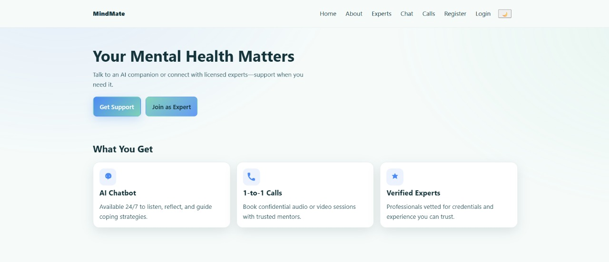
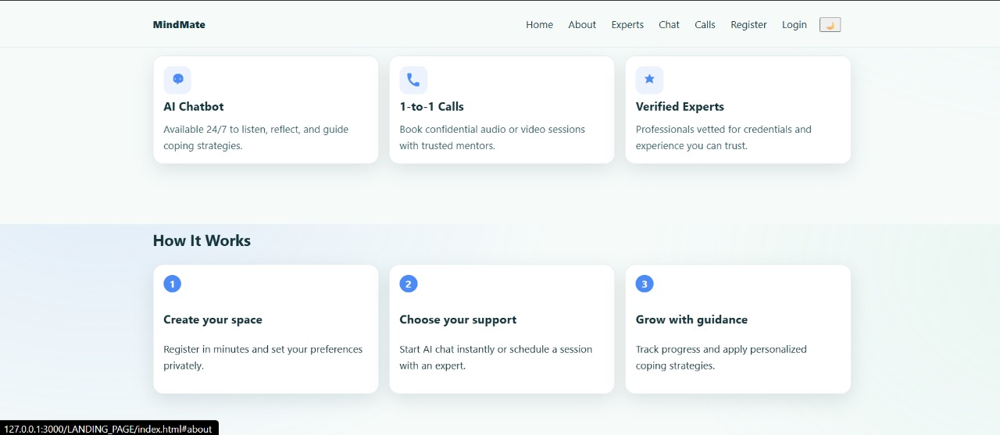

### Registration Flow
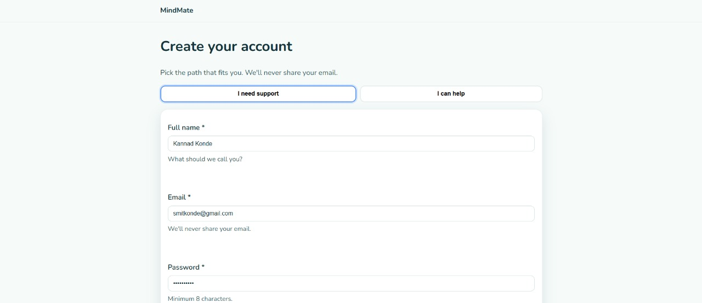
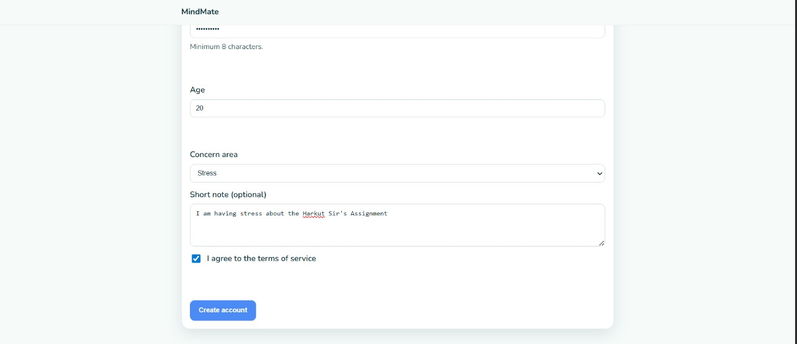
.jpg)
.jpg)
.jpg)

### Authentication
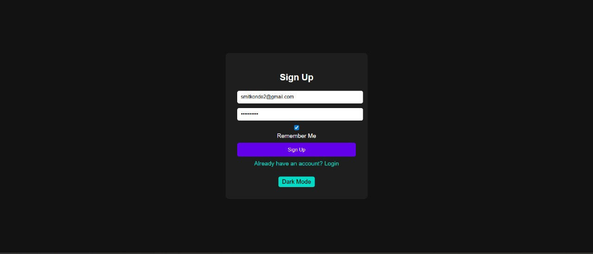
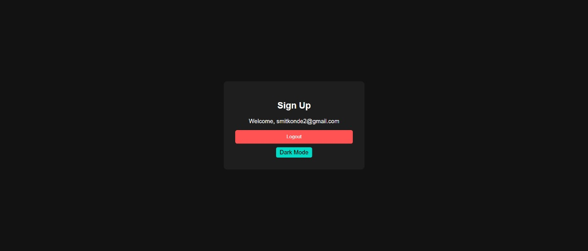

### Expert Discovery
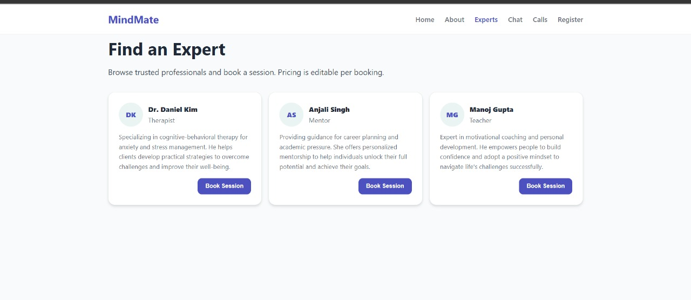
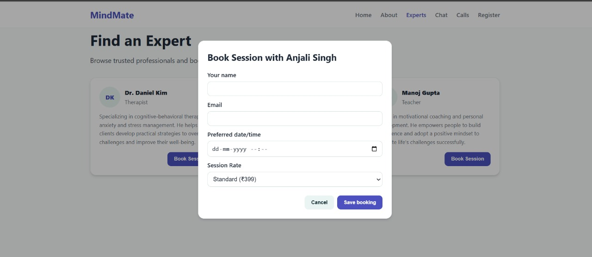
.jpg)

### Chat Interface
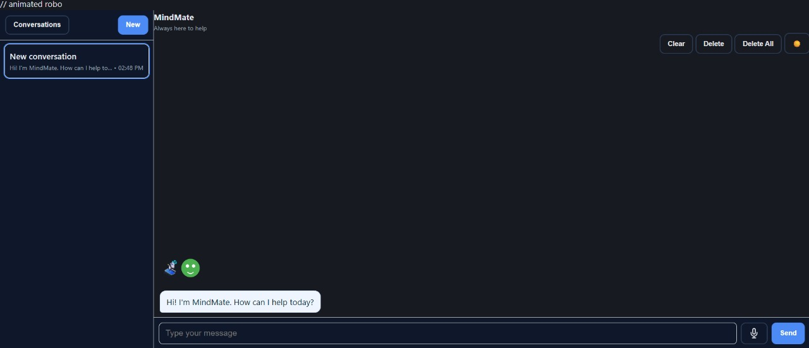
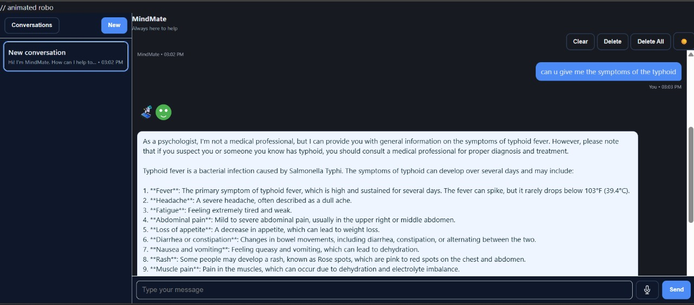

### Session Booking & Calls
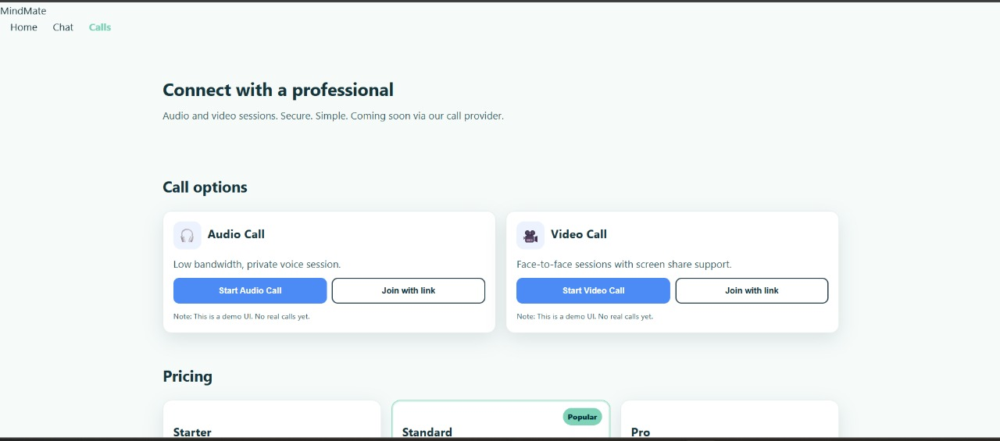
.jpg)

### Privacy & Legal
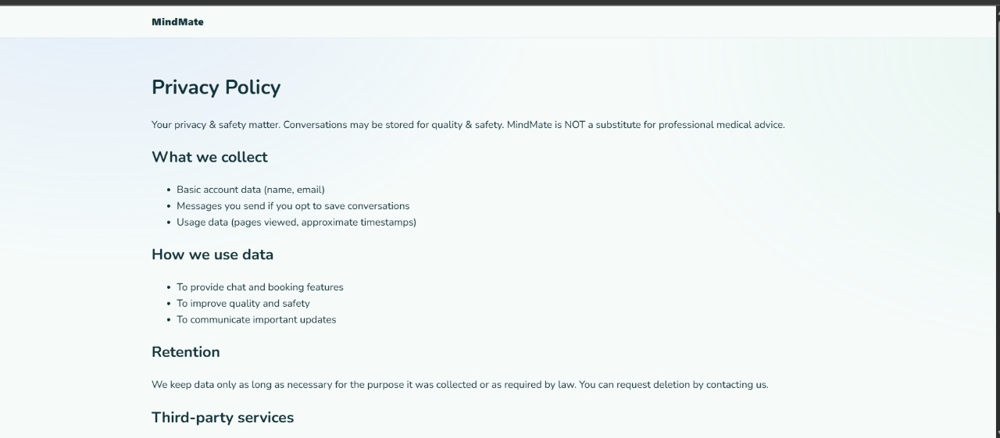
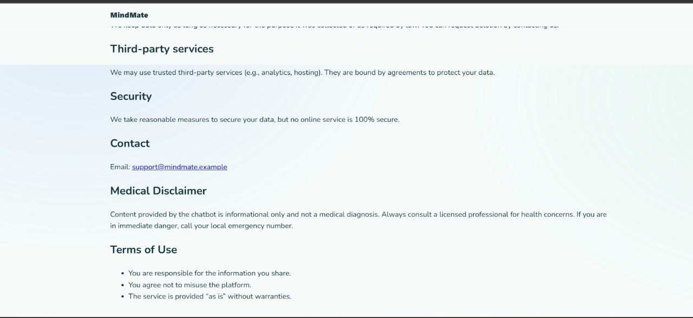

### Dark Mode
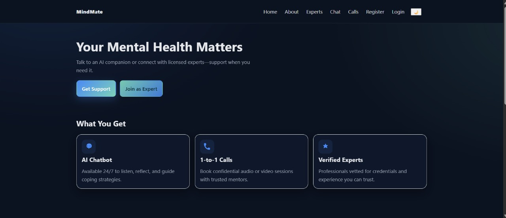
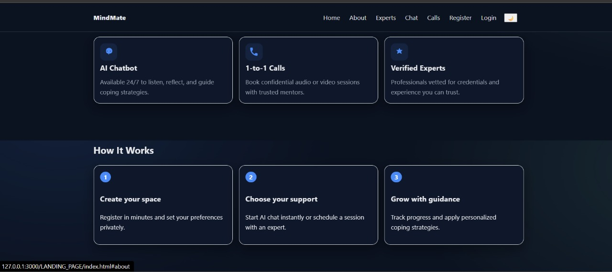

---

## Platform Architecture

```
┌──────────────────────────────────────────────────────────────────┐
│                        CLIENT LAYER                              │
│              HTML5  ·  CSS3  ·  Vanilla JavaScript               │
│                                                                  │
│   ┌────────────┐  ┌──────────────┐  ┌────────────────────────┐  │
│   │  Landing   │  │  Auth Flow   │  │   Chat  /  Experts /   │  │
│   │   Page     │  │  Sign-up     │  │   Calls / Legal Pages  │  │
│   └────────────┘  └──────────────┘  └────────────────────────┘  │
└────────────────────────────┬─────────────────────────────────────┘
                             │
┌────────────────────────────▼─────────────────────────────────────┐
│                    BACKEND LAYER (Planned)                        │
│          Firebase Auth  ·  Firestore DB  ·  Firebase Hosting     │
└────────────────────────────┬─────────────────────────────────────┘
                             │  (Roadmap)
┌────────────────────────────▼─────────────────────────────────────┐
│                    AI & CLINICAL LAYER                           │
│     NLP Triage  ·  Risk Flagging  ·  Therapist Matching Engine   │
└──────────────────────────────────────────────────────────────────┘
```

---

## Current Feature Set (MVP)

| Feature | Description | Status |
|---|---|---|
| Landing Page | Professional homepage with privacy policy and legal disclaimers | ✅ Complete |
| User Onboarding | Dual-path registration for support seekers and experts | ✅ Complete |
| Authentication | Secure login interface with session management | ✅ Complete |
| Chat Interface | AI-driven conversational support for immediate help | ✅ Complete |
| Expert Directory | Therapist/counsellor cards with profile info and pricing | ✅ Complete |
| Booking System | Mock appointment scheduling with session pricing | ✅ Complete |
| Calls Page | Placeholder infrastructure for video/audio therapy | ✅ Complete |
| Dark Mode | Full dark theme for accessibility and comfort | ✅ Complete |
| Legal Framework | Privacy policy, terms of service, clinical disclaimers | ✅ Complete |

---

## Technology Stack

| Layer | Technology | Rationale |
|---|---|---|
| Frontend | HTML5, CSS3, JavaScript | Lightweight, universally accessible, no framework overhead |
| Backend (Planned) | Firebase Auth + Firestore | Serverless architecture, rapid scaling, built-in auth |
| Hosting | GitHub Pages / Firebase Hosting | Zero-cost deployment for open-access platform |
| Past Exploration | Django (Python) | Initial backend research; validates server-side competency |
| AI Layer (Roadmap) | NLP / LLM APIs | Context-aware emotional support and clinical triage |

---

## Research Roadmap

MindMate's MVP is the foundation. The following research-driven modules define its trajectory:

### Phase 2 — Backend Integration
Full Firebase integration for persistent chat history, secure user profiles, and authenticated expert booking — replacing the current prototype-mode local file system.

### Phase 3 — AI Triage & Sentiment Analysis
An NLP pipeline that analyses user chat input in real time to detect emotional distress markers, flag crisis-level language, and route users to appropriate resources — including emergency contacts where necessary.

### Phase 4 — Therapist Marketplace
A verified expert onboarding system enabling licensed practitioners to list availability, set sliding-scale pricing, and conduct end-to-end sessions within MindMate — making affordable therapy transactional and accessible.

### Phase 5 — Video Teletherapy
WebRTC-based video and audio session infrastructure, enabling asynchronous and live therapy sessions with in-app scheduling, payments, and session notes.

### Phase 6 — Longitudinal Wellness Tracking
Mood journaling, progress dashboards, and predictive wellness analytics — enabling both users and practitioners to observe mental health trends over time.

---

## Ethical Design Principles

MindMate is built with clinical responsibility at the core — not as an afterthought.

- **Not a diagnostic tool** — All interfaces include clear legal disclaimers that MindMate does not constitute medical diagnosis or professional therapy.
- **Privacy-first architecture** — User data handling is designed to comply with data protection principles from the ground up.
- **Crisis safety protocols** — Future AI modules will include mandatory escalation pathways for users expressing suicidal ideation or self-harm intent.
- **Inclusivity by design** — Mobile-first, dark mode support, and low-bandwidth-friendly front end ensure the platform is usable by the populations that need it most.

---

## Setup & Local Development

### Prerequisites
- A modern web browser (Chrome, Firefox, Edge)
- Git

### Installation
```bash
# Clone the repository
git clone https://github.com/<your-username>/MindMate.git
cd MindMate

# Open locally
open LANDING_PAGE/index.html
```

Navigate between platform sections using the in-app menu links. No build step required for the current MVP.

> **Note:** Firebase integration is in development. The current version runs fully client-side and locally.

---

## Project Status

MindMate is currently in the **MVP / Prototype phase** — all core pages are functional and navigable locally. Backend persistence, AI chat intelligence, and therapist booking are staged for the next development sprint.

---

## About the Developer

MindMate is an independent student engineering project driven by a genuine belief that technology can democratise access to mental healthcare. Every design decision — from the dual-path registration flow to the legal disclaimer architecture — reflects research into real clinical and ethical constraints, not just software requirements.

The project demonstrates end-to-end product thinking: problem identification, user flow design, frontend implementation, legal consideration, and a research-backed AI roadmap — built entirely through self-directed learning.

---

## Contributing

Contributions are welcome — particularly in the areas of Firebase integration, accessibility improvements, and AI module research. Please open an issue to discuss proposed changes before submitting a pull request.

---

## Legal Notice

MindMate is a technology platform and does not provide licensed medical or psychological services. It is not a substitute for professional mental health treatment. In the event of a mental health emergency, please contact your local emergency services or a crisis helpline.

---

## License

This project is licensed under the MIT License. See `LICENSE` for details.

---

<div align="center">

*Engineered with empathy. Built for those who need it most.*

**⭐ If MindMate resonates with your vision for accessible mental healthcare — star this repository.**

</div>
